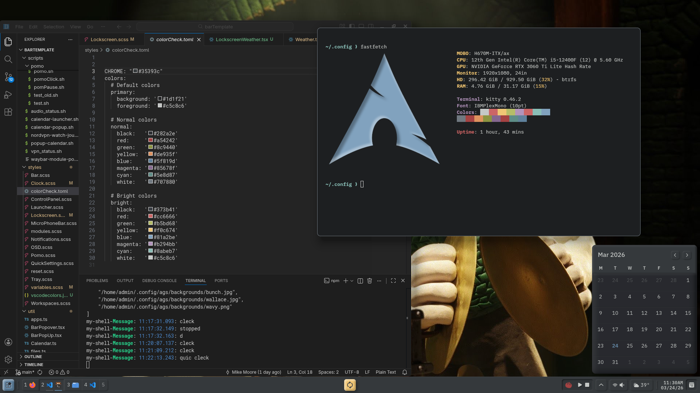
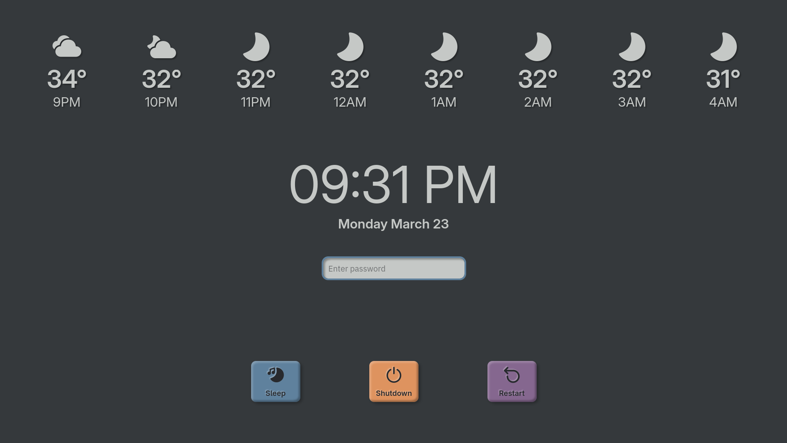
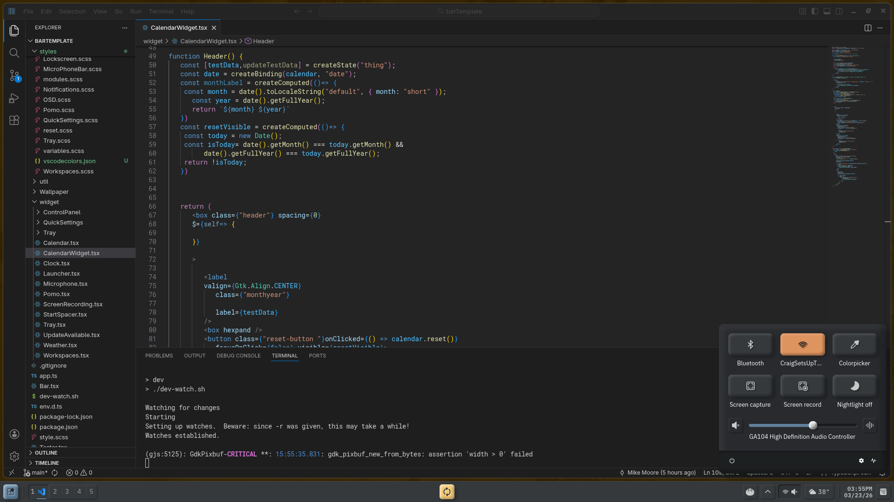
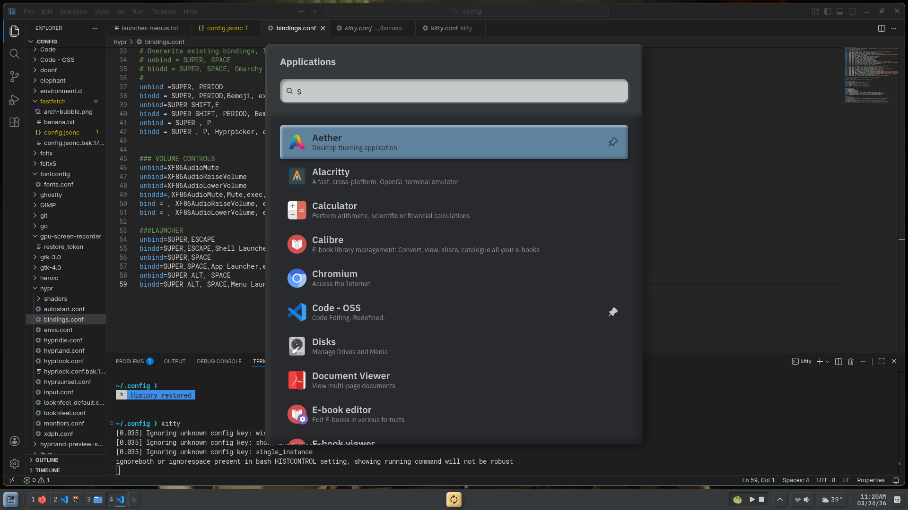

# AGS Shell
*Just an experiment. Code is not optimized / cleaned-up*

- Built on top of Omarchy, so you will see lots of references to `omarchy-` scripts
- Icons, I kept in .config. They're [Fluent icons](https://www.figma.com/community/file/836835755999342788)

## Screenshots

